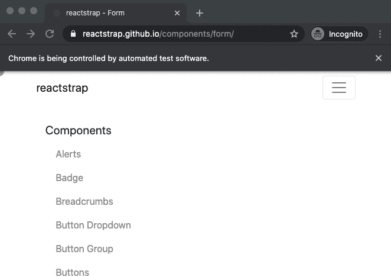
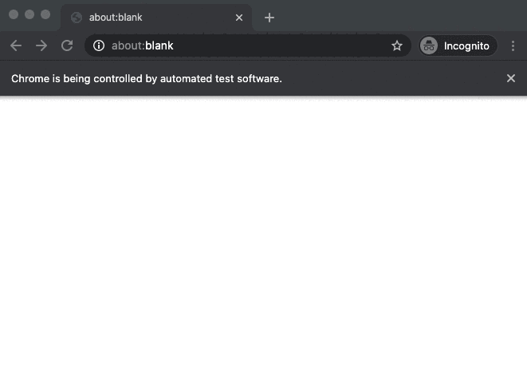

# Playwright Controller API

- Chainable Methods

  - [withBrowser(browser)](#withBrowserbrowser)
  - [withOptions(options)](#withOptionsoptions)
  - [withCursor()](#withCursor)
  - [emulateDevice(deviceName)](#emulateDevicedeviceName)
  - [navigateTo(url[, options])](#navigateTourl-options)
  - [click(selector[, options])](#clickselector-options)
  - [hover(selector[, options])](#hoverselector-options)
  - [pressKey(key[, options])](#pressKeykey-options)
  - [typeText(text[, options])](#typeTexttext-options)
  - [wait(duration)](#waitduration)
  - [waitUntil(predicate[, waitOptions])](#waitUntilpredicate-waitOptions)
  - [close()](#close)

- Helper Methods

  - [currentBrowser()](#currentBrowser)
  - [currentPage()](#currentPage)
  - [getCurrentUrl()](#getCurrentUrl)
  - [getCurrentWindowState()](#getCurrentWindowState)
  - [getValueOf(selector[, options])](#getValueOfselector-options)
  - [hasFocus(selector[, options])](#hasFocusselector-options)
  - [isDisabled(selector[, options])](#isDisabledselector-options)
  - [isEnabled(selector[, options])](#isEnabledselector-options)
  - [isVisible(selector[, options])](#isVisibleselector-options)

## Chainable Methods

### withBrowser(browser)

- browser : `BrowserName`

```js
BrowserName = 'chrome' | 'chromium' | 'firefox' | 'webkit';
```

Will launch a browser together with a new page by using all `playwright` default settings and options.

If you choose 'chrome' you must have an already installed Chrome.
BEWARE: Playwright is only guaranteed to work with the bundled Chromium, Firefox or WebKit, use at your own risk.

Example:

```js
const browser = 'chromium';
const pwc = new PlaywrightController();
await pwc.withBrowser(browser);

// now if you want to use the playwright API from this point:
const browser = pwc.currentBrowser();
const page = pwc.currentPage();

// the browser and page objects are standard playwright objects
// so now you are ready to go by using the playwright API
```

---

### withOptions(options)

- options : `LaunchOptions`

```js
interface LaunchOptions {
  /**
   * Whether to run browser in headless mode.
   * Defaults to true
   *
   * @type {boolean}
   * @memberof LaunchOptions
   */
  headless: boolean;

  /**
   * Additional arguments to pass to the browser instance.
   * The list of Chromium flags can be found at
   * https://peter.sh/experiments/chromium-command-line-switches/
   *
   * @type {string[]}
   * @memberof LaunchOptions
   */
  args?: string[];

  /**
   * Path to a browser executable to run instead of the bundled one.
   *
   * @type {string}
   * @memberof LaunchOptions
   */
  executablePath?: string;
}
```

Will set browser options to apply when launching the browser.

Example:

```js
const browser = 'chromium';
const pwc = new PlaywrightController();

// start the browser in headfull mode
await pwc.withBrowser(browser).withOptions({ headless: false });
```

---

### withCursor()

Will show the mouse position with a non intrusive cursor.

Example:

```js
const browser = 'chromium';
const url = 'https://reactstrap.github.io/components/form';
const pwc = new PlaywrightController();

await pwc
  .withBrowser(browser)
  .withOptions({ headless: false })
  .withCursor()
  .navigateTo(url);
```



---

### emulateDevice(deviceName)

- deviceName: `DeviceName`
  - see the [list of supported devices](/src/devices/device-names.ts)

Will emulate the selected device, and the browser window size and viewport will match the selected device.

Example:

```js
const browser = 'chromium';
const url = 'https://reactstrap.github.io/components/form';
const pwc = new PlaywrightController();

// start the browser in headfull mode
// and emulate an iPhone 6 in landscape mode
await pwc
  .withBrowser(browser)
  .withOptions({ headless: false })
  .emulateDevice('iPhone 6 landscape')
  .navigateTo(url);
```

---

### navigateTo(url[, options])

- url: `string`
- options: `NavigationOptions`

```js
interface NavigationOptions {
  /**
   * Maximum navigation time in milliseconds,
   * defaults to 30 seconds,
   * pass 0 to disable timeout
   *
   * @type {number}
   * @memberof NavigationOptions
   */
  timeout: number;
}
```

Will navigate to the specified url.

Example:

```js
const browser = 'chromium';
const url = 'https://reactstrap.github.io/components/form';
const pwc = new PlaywrightController();

// prettier-ignore
await pwc
  .withBrowser(browser)
  .navigateTo(url);

// now if you want to use the playwright API from this point:
const browser = pwc.currentBrowser();
const page = pwc.currentPage();

// the browser and page objects are standard playwright objects
// so now you are ready to go by using the playwright API
```

---

### hover(selector[, options])

- selector: `string | SelectorController`
- options: `Partial<HoverOptions>`

```js
interface HoverOptions {
  timeoutInMilliseconds: number;
  stabilityInMilliseconds: number;
  steps: number;
  verbose: boolean;
}
```

Will hover on the specified selector. The selector can be either a CSS selector or Selector Object created by the [Selector API](/docs/selector.api.md).

Example:

```js
const browser = 'chromium';
const url = 'https://reactstrap.github.io/components/form';
const selector = '#exampleCustomRange';
const pwc = new PlaywrightController();

await pwc
  .withBrowser(browser)
  .withOptions({ headless: false })
  .withCursor()
  .navigateTo(url)
  .hover(selector);

// now if you want to use the playwright API from this point:
const browser = pwc.currentBrowser();
const page = pwc.currentPage();

// the browser and page objects are standard playwright objects
// so now you are ready to go by using the playwright API
```

Example with a Selector Object:

```js
const browser = 'chromium';
const url = 'https://reactstrap.github.io/components/form';
const pwc = new PlaywrightController();
const selector = pwc
  .selector('label')
  .withText('Email')
  .nth(3);

await pwc
  .withBrowser(browser)
  .withOptions({ headless: false })
  .withCursor()
  .navigateTo(url)
  .hover(selector);

// now if you want to use the playwright API from this point:
const browser = pwc.currentBrowser();
const page = pwc.currentPage();

// the browser and page objects are standard playwright objects
// so now you are ready to go by using the playwright API
```

---

### click(selector[, options])

- selector: `string | SelectorController`
- options: `Partial<ClickOptions>`

```js
interface ClickOptions {
  button: 'left' | 'right' | 'middle';
  clickCount: number;
  delay: number;
  modifiers?: Modifier[];
  relativePoint?: Point;
  stabilityInMilliseconds: number;
  timeoutInMilliseconds: number;
  verbose: boolean;
}

type Modifier = 'Alt' | 'Control' | 'Meta' | 'Shift';
type Point = {
  x: number,
  y: number,
};
```

Will click on the specified selector. The selector can be either a CSS selector or Selector Object created by the [Selector API](/docs/selector.api.md).

This method automatically waits for the selector to be visible, then hovers over it, then waits until it is enabled and finally click on it.

Example:

```js
const url = 'https://reactstrap.github.io/components/form';
const checkMeOut = pwc.selector('label').withText('Check me out');

await pwc
  .withBrowser('chromium')
  .withOptions({ headless: false })
  .withCursor()
  .emulateDevice('iPhone 6 landscape')
  .navigateTo(url)
  .click(checkMeOut)
  .expectThat(checkMeOut.find('input'))
  .hasFocus();

// now if you want to use the playwright API from this point:
const browser = pwc.currentBrowser();
const page = pwc.currentPage();

// the browser and page objects are standard playwright objects
// so now you are ready to go by using the playwright API
```



---

### pressKey(key[, options])

- key: `'Tab' | 'Backspace' | 'Enter'`
- options: `Partial<KeyboardPressOptions>`

```js
interface KeyboardPressOptions {
  /**
   * Time to wait between keydown and keyup in milliseconds.
   * Defaults to 50.
   *
   * @type {number}
   * @memberof KeyboardPressOptions
   */
  delay: number;
}
```

Will press the specified key.

---

### typeText(text[, options])

- text: `string`
- options: `Partial<TypeTextOptions>`

```js
interface TypeTextOptions {
  /**
   * Time to wait between key presses in milliseconds.
   * Defaults to 50
   *
   * @type {number}
   * @memberof TypeTextOptions
   */
  delay: number;
}
```

Will type text in the element that has current focus. This method will automtically empty any existing content before typing the specified text.

---

### wait(duration)

- duration: `number`

  time to wait in milliseconds.

---

### waitUntil(predicate[, waitOptions])

- predicate: `() => Promise<boolean>`
- waitOptions: `Partial<WaitUntilOptions>`

Will wait until predicate becomes true.

Usage example:

```js
const selector = pptc
  .selector('[role="row"]')
  .find('td')
  .find('p');
  .withText('foobar');

await pptc.waitUntil(() => selector.isVisible());
```

---

### close()

Will close the browser. This should be the last method called in the chain.

---

## Helper Methods

### getCurrentUrl()

- returns: `Promise<string>`

Get the current url opened by the current page.

---

### getCurrentWindowState()

- returns: `Promise<WindowState>`

Get infos about the browser's window dimensions.

```js
interface WindowState {
  /**
   * Interior height of the browser window in pixels,
   * including the height of the horizontal scroll bar, if present.
   *
   * @type {number}
   * @memberof WindowState
   */
  innerHeight: number;

  /**
   * Interior width of the browser window in pixels.
   * This includes the width of the vertical scroll bar,
   * if one is present.
   *
   * @type {number}
   * @memberof WindowState
   */
  innerWidth: number;
  /**
   * Tells if the browser window is very near to the screen size
   *
   * @type {boolean}
   * @memberof WindowState
   */
  isMaximized: boolean;

  /**
   * Width of the whole browser window,
   * including sidebar (if expanded),
   * window chrome and window resizing borders/handles
   *
   * @type {number}
   * @memberof WindowState
   */
  outerHeight: number;

  /**
   *
   *
   * @type {number}
   * @memberof WindowState
   */
  outerWidth: number;
  screen: {
    availWidth: number,
    availHeight: number,
  };
}
```

---

### getValueOf(selector[, options])

- selector: `string`
- options: `Partial<WaitUntilOptions>`
- returns: `Promise<string | undefined | null>`

Get selector's value.

> The controller waits until the selector appears in the DOM. This waiting mechanism can be customized through the `options` parameter.

```js
interface WaitUntilOptions {
  /**
   * Defaults to 30000 milliseconds.
   *
   * @type {number}
   * @memberof WaitUntilOptions
   */
  timeoutInMilliseconds: number;
  /**
   * Time during which the callback must always return true.
   * Defaults to 300 milliseconds.
   * You must not setup a duration < 100 milliseconds.
   * @type {number}
   * @memberof AssertOptions
   */
  stabilityInMilliseconds: number;
  /**
   * Throw a timeout exception when the callback still returns false.
   * Defaults to false.
   * @type {boolean}
   * @memberof WaitUntilOptions
   */
  throwOnTimeout: boolean;
  /**
   * Output to the console all steps of the waiting mechanism.
   * Defaults to false.
   * Use this option when the waitUntil() method does not wait as expected.
   *
   * @type {boolean}
   * @memberof WaitUntilOptions
   */
  verbose: boolean;
}
```

---

### hasFocus(selector[, options])

- selector: `string | SelectorController`
- options: `Partial<WaitUntilOptions>`
- returns: `Promise<boolean>`

Checks if selector has the focus.

> The controller waits until the selector appears in the DOM. This waiting mechanism can be customized through the `options` parameter.

---

### isDisabled(selector[, options])

- selector: `string | SelectorController`
- options: `Partial<WaitUntilOptions>`
- returns: `Promise<boolean>`

Checks if selector is disabled.

> The controller waits until the selector appears in the DOM. This waiting mechanism can be customized through the `options` parameter.

---

### isEnabled(selector[, options])

- selector: `string | SelectorController`
- options: `Partial<WaitUntilOptions>`
- returns: `Promise<boolean>`

Checks if selector is enabled.

> The controller waits until the selector appears in the DOM. This waiting mechanism can be customized through the `options` parameter.

---

### isVisible(selector[, options])

- selector: `string | SelectorController`
- options: `Partial<WaitUntilOptions>`
- returns: `Promise<boolean>`

Checks if selector is visible.

> The controller waits until the selector appears in the DOM. This waiting mechanism can be customized through the `options` parameter.

---

### currentPage()

- returns: `Page | undefined`

Get Playwright's page instance of the controller in order to do stuff not covered by this API.

Example:

```js
const pwc = new PlaywrightController();

// use the pwc controller API
// ...

const page = pwc.currentPage();

// now use this page instance through the playwright API
```

---

### currentBrowser()

- returns: `Browser | undefined`

Get Playwright's browser instance of the controller in order to do stuff not covered by this API.

Example:

```js
const pwc = new PlaywrightController();

// use the pwc controller API
// ...

const browser = pwc.currentBrowser();

// now use this browser instance through the playwright API
```

---
